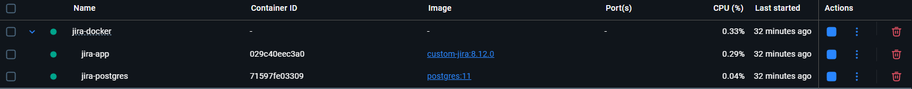
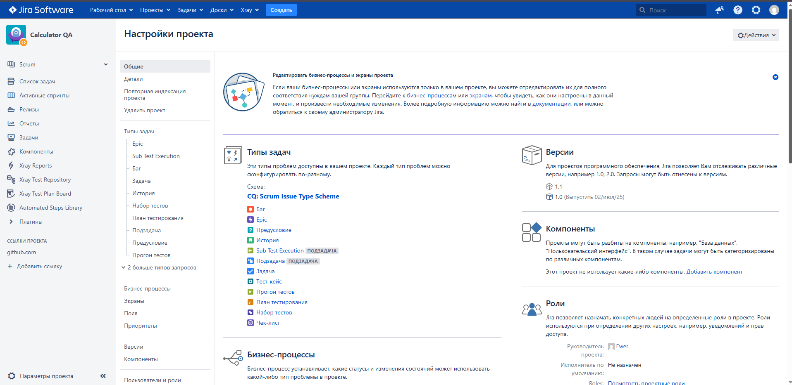

#  Jira Server 8.12 + Docker

> **Предупреждение**  
> Использование кастомных .jar файлов для обхода лицензирования нарушает [условия использования Atlassian](https://www.atlassian.com/licensing). Данная инструкция предназначена только для образовательных целей.
> Ссылка на основной источник информации [IAlexEgorov/AtlassianCrack](https://github.com/IAlexEgorov/AtlassianCrack/tree/main)

##  Предварительные требования
- Docker Engine
- Docker Compose
- PostgreSQL 11
- 4+ GB свободной RAM
- Порты 8080 (Jira) и 5432 (PostgreSQL) свободны

## Подготовка
1. Установите PostgreSQL 11 версии или ниже (Для Jira server 8.12)
2. Настройка в PgAdmin 4 (Необязательно)
3. Создать папку для контейнеров Docker
4. В папке создать docker-compose.yml и внутри настроить как Jira так и PostgreSQL
5. Создать Dockerfile из репозитория AtlassianCrack
6. Скачать из репозитория atlassian-extras-3.2.jar и atlassian-keygen.php и положить в папку

## Установка
1. docker-compose build и docker-compose up -d
2. Зайти на localhost:8080
3. Выбрать "I'll set it up myself" и заполнить поля
4. На экране ввода лицензионого ключа в папке создаем license_key_product.txt по примеру из AtlassianCrack (Замените на свой Server ID)
5. php atlassian-keygen.php -e license_key_product.txt
6. Вводим полученый ключ

**Для плагинов из магазина вам необходим новый license_key_product.txt по примеру license_key_gliffy_jira.txt в AtlassianCrack**

## Скриншот

